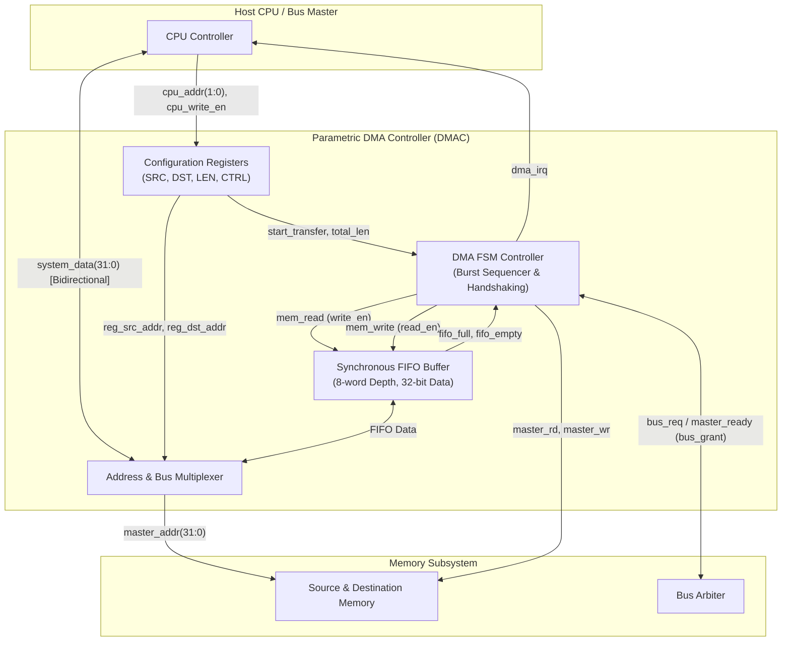
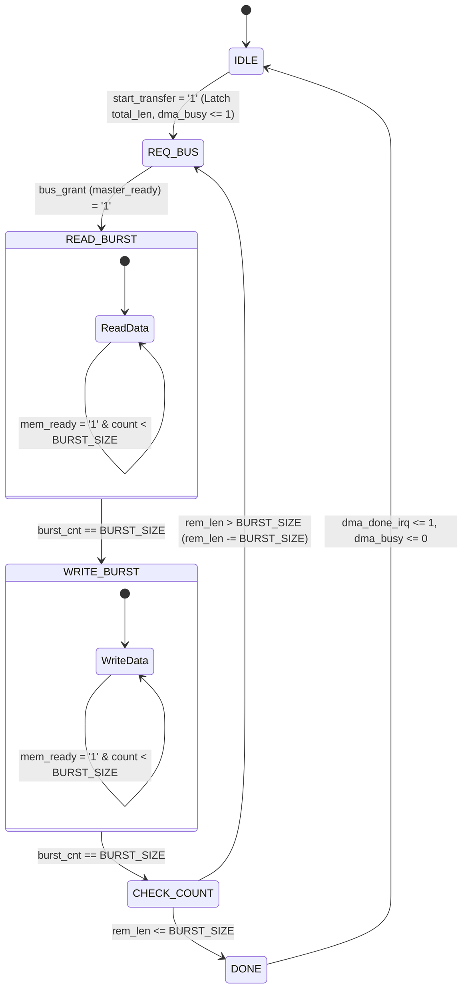

# Parametric Single-Channel DMA Controller (VHDL-2008)

[](https://en.wikipedia.org/wiki/VHDL)
[](https://www.intel.com)
[](https://www.intel.com/content/www/us/en/software/programmable/quartus-prime/overview.html)
[](https://eda.sw.siemens.com/en-US/ic/modelsim/)
[](#synthesis--resource-utilization)

A high-performance, fully synthesizable, parametric **Single-Channel Direct Memory Access (DMA) Controller** written in **VHDL-2008**. The core offloads data transfer operations between memory peripherals from the host CPU, utilizing an efficient burst-based Finite State Machine (FSM), integrated synchronous circular FIFO buffering, and a shared bidirectional tri-state system data bus.

---

## Table of Contents

- [Key Features](#key-features)
- [Architecture Overview](#architecture-overview)
- [Module Breakdown](#module-breakdown)
  - [Top-Level DMAC (`DMAC.vhd`)](#top-level-dmac-dmacvhd)
  - [Burst-Transfer FSM (`dma_fsm.vhd`)](#burst-transfer-fsm-dma_fsmvhd)
  - [Circular Synchronous FIFO (`dma_fifo.vhd`)](#circular-synchronous-fifo-dma_fifovhd)
- [Register Map & Addressing](#register-map--addressing)
- [Port Interface Description](#port-interface-description)
- [Transfer Flow & Handshaking](#transfer-flow--handshaking)
- [Synthesis & Resource Utilization](#synthesis--resource-utilization)
- [Verification & Simulation](#verification--simulation)
  - [Simulation with ModelSim / QuestaSim](#simulation-with-modelsim--questasim)
  - [Open-Source Simulation with GHDL](#open-source-simulation-with-ghdl)
- [Repository Structure](#repository-structure)
- [Roadmap](#roadmap)
- [Author & License](#author--license)

---

## Key Features

- **VHDL-2008 Standard**: Fully synthesizable, standards-compliant, RTL code.
- **Parametric Burst Transfer**: Configurable burst lengths (default: 4 beats per burst) for optimal memory bus utilization.
- **Decoupled Synchronous FIFO**: Parametric circular buffer (default: 32-bit data width, depth of 8 words) that decouples read and write phases, accommodating multiple bursts.
- **Deterministic Handshaking**: Master bus interface with active handshaking signals (`bus_req`, `bus_grant`, `mem_ready`) supporting wait states.
- **CPU Offloading**: Software-programmable control and address registers; generates an active-high interrupt pulse (`dma_irq`) upon transfer completion.
- **Bidirectional Tri-State Bus Management**: Efficient multiplexing and high-impedance handling on the shared `system_data` bus.
- **Self-Checking Testbench**: End-to-end verification environment validating programming sequence, bus request arbitration, memory read/write cycles, and IRQ generation.

---

## Architecture Overview

The DMA controller interfaces with the host CPU via a slave configuration interface and with the memory subsystem via a master memory interface:



---

## Module Breakdown

### Top-Level DMAC (`DMAC.vhd`)
Coordinates the configuration registers, internal FIFO buffer, burst FSM, and memory bus multiplexing.
- **Tri-State Data Bus Management**: Automatically drives `system_data` from the internal FIFO during write cycles (`master_wr = '1'`) and tri-states (`'Z'`) during idle and read phases.
- **Dynamic Address Steering**: Routes `reg_src_addr` to `master_addr` during read bursts and `reg_dst_addr` during write bursts.
- **Auto-Clearing Start Bit**: Clears `reg_ctrl(0)` automatically once `dma_busy` is asserted.

### Burst-Transfer FSM (`dma_fsm.vhd`)
The state machine implements a robust 6-state sequencing engine:



- **`IDLE`**: Awaits CPU configuration and transfer initiation (`reg_ctrl(0) = '1'`).
- **`REQ_BUS`**: Asserts `bus_req = '1'` to request master access to the memory bus.
- **`READ_BURST`**: Reads `BURST_SIZE` words into the FIFO while asserting `mem_read`. Increments burst counter on each cycle where `mem_ready = '1'`.
- **`WRITE_BURST`**: Drains `BURST_SIZE` words from the FIFO to destination memory while asserting `mem_write`. Increments counter on `mem_ready = '1'`.
- **`CHECK_COUNT`**: Compares remaining length against `BURST_SIZE`. Loops back to `REQ_BUS` for remaining blocks or moves to completion.
- **`DONE`**: Generates a single-cycle completion interrupt pulse (`dma_done_irq = '1'`), deasserts `dma_busy`, and returns to `IDLE`.

### Circular Synchronous FIFO (`dma_fifo.vhd`)
- Implements an internal circular ring-buffer (`FIFO_DEPTH = 8`, `DATA_WIDTH = 32`).
- Supports simultaneous push and pop cycles while keeping occupancy count accurate.
- Outputs `full` and `empty` threshold flags to gate FSM burst reads and writes, preventing buffer underflow/overflow.

---

## Register Map & Addressing

The CPU programs the DMA controller using the 2-bit `cpu_addr` port and an active-high `cpu_write_en` strobe:

| Address (`cpu_addr`) | Register Name | Width | Access | Description |
| :---: | :---: | :---: | :---: | :--- |
| `2'b00` | **`SRC_ADDR`** | 32-bit | W | Source memory base address (`system_data[31:0]`). |
| `2'b01` | **`DST_ADDR`** | 32-bit | W | Destination memory base address (`system_data[31:0]`). |
| `2'b10` | **`LEN`** | 16-bit | W | Total transfer word count (`system_data[15:0]`). |
| `2'b11` | **`CTRL`** | 8-bit | W | Control register (`system_data[7:0]`). Bit `[0]` = Start Transfer (auto-cleared by hardware). Bits `[7:1]` = Reserved. |

---

## Port Interface Description

| Port Name | Direction | Width | Type | Description |
| :--- | :---: | :---: | :---: | :--- |
| `clk` | Input | 1 | `std_logic` | Main system clock (e.g., 50 MHz). |
| `reset` | Input | 1 | `std_logic` | Asynchronous system reset (active High). |
| `cpu_addr` | Input | 2 | `std_logic_vector` | CPU register address select (`00`: SRC, `01`: DST, `10`: LEN, `11`: CTRL). |
| `cpu_write_en` | Input | 1 | `std_logic` | Active-high CPU register write enable. |
| `system_data` | Inout | 32 | `std_logic_vector` | Shared 32-bit bidirectional data bus (CPU write data, memory read/write data). |
| `master_addr` | Output | 32 | `std_logic_vector` | Master memory address bus output. |
| `master_rd` | Output | 1 | `std_logic` | Master memory read strobe (active High). |
| `master_wr` | Output | 1 | `std_logic` | Master memory write strobe (active High). |
| `master_ready` | Input | 1 | `std_logic` | Memory handshake / ready input (acts as bus grant & wait-state release). |
| `dma_irq` | Output | 1 | `std_logic` | Interrupt request output (1-cycle active-high pulse upon completion). |

---

## Transfer Flow & Handshaking

```
Clock:        ___/¯\_/¯\_/¯\_/¯\_/¯\_/¯\_/¯\_/¯\_/¯\_/¯\_/¯\_/¯\_/¯\_/¯\_/¯\_
cpu_write_en: __/¯¯¯¯¯\______________________________________________________
cpu_addr:     --< SRC >< DST >< LEN >< CTRL >--------------------------------
dma_busy:     __________/¯¯¯¯¯¯¯¯¯¯¯¯¯¯¯¯¯¯¯¯¯¯¯¯¯¯¯¯¯¯¯¯¯¯¯¯¯¯¯¯¯¯¯¯¯\______
FSM State:    --[IDLE]-[REQ_BUS]-[ READ_BURST ]-[ WRITE_BURST ]-[DONE]-[IDLE]
master_rd:    ___________________/¯¯¯¯¯¯¯¯¯¯¯\_______________________________
master_wr:    __________________________________/¯¯¯¯¯¯¯¯¯¯¯\________________
master_ready: __________/¯¯¯¯¯¯¯¯¯¯¯¯¯¯¯¯¯¯¯¯¯¯¯¯¯¯¯¯¯¯¯¯¯¯¯¯\_______________
dma_irq:      __________________________________________________/¯¯¯\________
```

1. **CPU Configuration**: Host writes Source Address, Destination Address, and Word Length, then asserts bit 0 of Control Register.
2. **Bus Arbitration**: FSM raises bus request and waits for `master_ready` assertion.
3. **Read Phase**: Words are read sequentially into the internal FIFO on each cycle where `master_ready` is asserted.
4. **Write Phase**: Words are burst-written from the FIFO to the destination address.
5. **Length Evaluation**: If transfer length exceeds burst size, the FSM requests the bus again for subsequent bursts.
6. **Completion**: DMA raises `dma_irq` for one cycle, deasserts `dma_busy`, and returns to `IDLE`.

---

## Synthesis & Resource Utilization

The design has been synthesized and placed & routed on an **Intel Cyclone IV GX** FPGA using **Quartus II 64-Bit (13.1 Web Edition)**.

| Metric | Utilized | Available | Percentage |
| :--- | :---: | :---: | :---: |
| **Target Device** | \multicolumn{3}{c|}{`EP4CGX22CF19C6` (Cyclone IV GX)} |
| **Total Logic Elements (LEs)** | 428 | 21,280 | 2.0 % |
| **Combinational Functions** | 269 | 21,280 | 1.3 % |
| **Dedicated Logic Registers** | 376 | 21,280 | 1.8 % |
| **Total Registers** | 376 | — | — |
| **Total I/O Pins** | 73 | 167 | 43.7 % |
| **Embedded Multipliers (9-bit)** | 0 | 80 | 0.0 % |
| **Total Memory Bits (M9K)** | 0 | 774,144 | 0.0 % *(FIFO in LE registers)* |
| **PLLs** | 0 | 4 | 0.0 % |

---

## Verification & Simulation

A comprehensive self-checking testbench (`DMAC_tb.vhd`) is provided. It:
1. Resets the controller.
2. Programs the registers (`SRC = 0x00001000`, `DST = 0x00002000`, `LEN = 8`, `START = 1`).
3. Emulates responsive memory by supplying data patterns (`0xABCD1234`) on DMA read cycles and accepting data on write cycles.
4. Validates that the entire 8-word transfer (2 bursts of 4 words) finishes with `dma_irq` firing correctly.

### Simulation with ModelSim / QuestaSim

A pre-configured macro script (`setup.do`) is included for quick one-click execution:

1. Open **ModelSim** or **QuestaSim**.
2. Navigate to the project directory or run:
   ```tcl
   do setup.do
   ```
   *Note: If paths in `setup.do` differ on your machine, update lines 1 and 4 with your local path.*

Alternatively, run the compilation and simulation steps directly in the ModelSim transcript window:

```tcl
vlib work
vmap work work

# Compile VHDL-2008 sources in dependency order
vcom -2008 dma_fifo.vhd
vcom -2008 dma_fsm.vhd
vcom -2008 DMAC.vhd
vcom -2008 DMAC_tb.vhd

# Launch simulation and view waveforms
vsim work.DMAC_tb
add wave -recursive *
run 20 us
```

### Open-Source Simulation with GHDL

You can also simulate using [GHDL](https://github.com/ghdl/ghdl) and view waveforms with [GTKWave](http://gtkwave.sourceforge.net/):

```bash
# Analyze sources with VHDL-2008 standard
ghdl -a --std=08 dma_fifo.vhd
ghdl -a --std=08 dma_fsm.vhd
ghdl -a --std=08 DMAC.vhd
ghdl -a --std=08 DMAC_tb.vhd

# Elaborate testbench entity
ghdl -e --std=08 DMAC_tb

# Run simulation and dump VCD waveform
ghdl -r --std=08 DMAC_tb --vcd=wave.vcd --stop-time=20us

# View waveform in GTKWave
gtkwave wave.vcd
```

---

## Repository Structure

```text
parametric-dma-controller-vhdl/
├── DMAC.vhd             # Top-level entity combining FSM, FIFO, and register interface
├── dma_fsm.vhd          # Finite State Machine governing burst transfer sequencing
├── dma_fifo.vhd         # Parameterized circular buffer synchronous FIFO
├── DMAC_tb.vhd          # Self-checking testbench with memory handshake model
├── setup.do             # ModelSim/QuestaSim automated simulation script
├── DMAC.qpf             # Intel Quartus Project File
├── DMAC.qsf             # Intel Quartus Settings and Pin/Device Constraints
├── output_files/        # Quartus compilation, fitting, and timing reports
│   ├── DMAC.fit.summary # Resource utilization summary
│   ├── DMAC.map.summary # Analysis & Synthesis summary
│   └── DMAC.sta.summary # TimeQuest timing analyzer report
└── README.md            # Project documentation
```

---

## Roadmap

- [x] VHDL-2008 core implementation with burst FSM.
- [x] Circular synchronous FIFO decoupling.
- [x] Complete self-checking testbench.
- [x] Quartus II synthesis and Cyclone IV GX timing verification.
- [ ] **AXI4-Lite Slave Interface**: Standardizing control registers into an industry-standard bus protocol for plug-and-play SoC integration.
- [ ] **AXI4 / Avalon-MM Master Interface**: Adding true high-speed bus master burst wrappers.
- [ ] **Auto-Incrementing Address Generators**: Configurable stride and automatic address incrementing across bursts.
- [ ] **Multi-Channel Support**: Channel arbiter supporting priority queuing and round-robin scheduling.
- [ ] **Scatter-Gather DMA**: Descriptor-based chaining in system memory.

---

## Author & License

- **Author**: [mouad11-11](https://github.com/mouad11-11)
- **License**: Open-source under the [MIT License](LICENSE) (or applicable project license).
